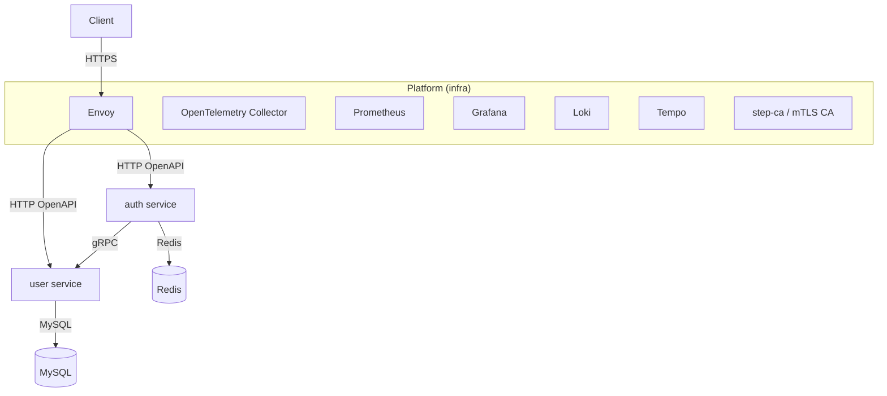

# go-production-backend

[](https://codecov.io/gh/Incheat/go-production-backend)


A **production-oriented Go backend monorepo** demonstrating *real-world* engineering practices:
contract-first APIs, microservice boundaries, secure networking (mTLS), CI security scans, observability, and production-like local infrastructure.

> This repository is not a “toy project”. It’s meant to look and feel like a real system you can operate.

---

## 🎯 Project goals

- End-to-end ownership: design → implement → test → deploy → operate
- Contract-first development (OpenAPI + gRPC)
- Production-like local environment (proxy, mTLS, telemetry stack)
- Practical reference architecture for Go backend engineers

---

## 🧱 Architecture overview

### High-level architecture



Why this shape:
- **Envoy is the platform edge**: CORS / rate limiting / retries / TLS/mTLS are handled at the proxy/platform layer, not sprinkled through app code.
- **Auth ↔ User talks over gRPC** for internal service-to-service calls.
- **User owns persistence** (MySQL + migrations/sqlc).
- **Auth uses Redis** for refresh-token/session style storage.
- **Observability is first-class** (metrics, logs, traces).

---

## 🔍 Services and responsibilities

| Service | Responsibility |
|---|---|
| **auth** | Public auth HTTP API, token issuance (JWT + refresh), refresh token storage (Redis), calls user via gRPC |
| **user** | User domain + persistence (MySQL), exposes internal gRPC + (optional/private) HTTP endpoints |

### Service layering

Each service follows a consistent layering to keep business logic transport-agnostic:

- `handler/` — transport (HTTP/gRPC) layer
- `service/` — business logic / use-cases
- `repository/` — persistence (DB) + query layer
- `gateway/` — integrations (e.g., other services)
- `config/` — config wiring

---

## 🧩 Contract-first APIs (single source of truth)

All contracts live in `api/` and are treated as authoritative:

- OpenAPI → HTTP APIs
- Protobuf/gRPC → service-to-service APIs

Generated code must never be edited; services communicate via generated clients only.

---

## 🧱 Repo layout (what goes where)

- `api/` — OpenAPI + gRPC contracts (source of truth)
- `services/` — deployable services (`auth`, `user`)
- `pkg/obs/` — shared observability utilities (logging/metrics/tracing/correlation/otel)
- `infra/` — platform runtime (Envoy, mTLS CA, telemetry stack)
- `deploy/helm/` — Kubernetes charts
- `make/` — modular make targets (oapi/grpc/sqlc/migrate/helm/security)
- `test/` — integration + BDD + contract (Pact) tests

---

## 🔐 Security model

- JWT access tokens + refresh tokens (stored/managed via Auth service + Redis)
- mTLS-ready platform (step-ca + cert generation/management)
- CI security posture: `gosec`, `govulncheck` (and related checks as configured)

---

## 📊 Observability

This repo treats observability as a product feature:

- Structured logging with correlation IDs
- Metrics + tracing via OpenTelemetry
- Platform stack: Prometheus + Grafana + Loki + Tempo (via `infra/`)

The goal is for debugging and performance analysis to be possible from day one.

---

## 🧪 Testing strategy

This repository supports multiple testing styles:

- Unit tests for pure logic
- Integration tests for DB/redis/service boundaries
- Contract tests (Pact) to lock consumer/provider expectations

---

## ▶️ Running locally

### Prerequisites

- Go **1.22+**
- Docker & Docker Compose

### Start the full stack (recommended)

```bash
docker-compose up --build
```

This brings up **services + infra** (gateway, telemetry, backing services) so local behaves like production.

---

## 🧭 Engineering conventions

- Conventional commits
- Structured branch naming
- Consistent naming rules (packages, files, identifiers)
- Code generation & migrations via `make/` targets

---

## 📌 Status

🚧 **Actively evolving** (recent infra/observability work is ongoing).
