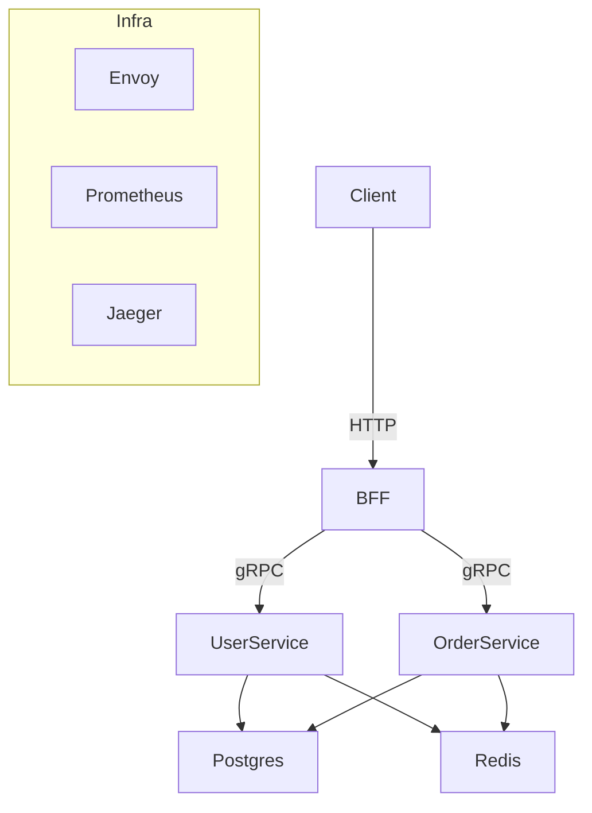
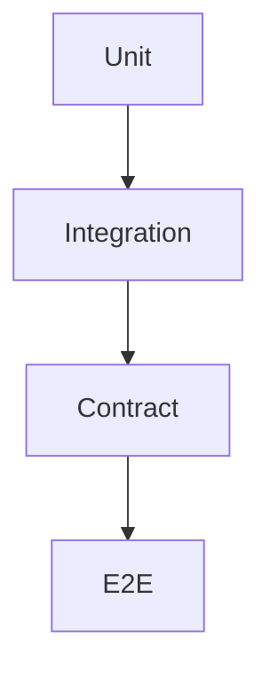
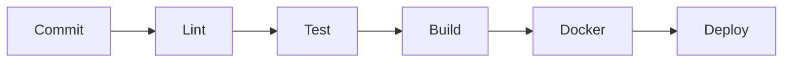

# go-production-backend
[](https://codecov.io/gh/Incheat/go-production-backend)


A **production-oriented Go backend system** designed to demonstrate real-world engineering practices, architectural decision-making, and operational excellence.

This repository is **not a toy project**.  
It is built to reflect how modern backend systems are designed, implemented, tested, deployed, and operated in production environments.

---

## 🎯 Project Goals

- Demonstrate **end-to-end ownership**
  - Requirement analysis → API design → implementation → CI/CD → observability
- Apply **resilience engineering** principles
- Design **high-QPS, production-ready endpoints**
- Serve as a **reference backend architecture** for Go engineers

---

## 🧱 Architecture Overview

### High-Level Architecture



### Why Microservices (Not a Monolith)?

| Consideration | Decision |
|--------------|----------|
| Team scalability | Independent services |
| Deployment | Isolated rollouts |
| Fault isolation | Failure containment |
| Technology evolution | Per-service flexibility |

> Trade-off acknowledged: Microservices add operational complexity.  
> This repo demonstrates *how to manage that complexity correctly*.

---

## 🔍 Service Scope & Responsibility

Each service follows **Single Responsibility Principle**:

| Service | Responsibility |
|-------|----------------|
| BFF | API aggregation, auth, client-specific shaping |
| User Service | User identity & profile |
| Order Service | Order lifecycle |

Boundaries are defined by:
- Business capability
- Data ownership
- Independent scaling needs

---

## 🌐 API Design

### API-First Development (OpenAPI)

- OpenAPI (OAPI) is the **single source of truth**
- Enables:
  - Contract-first development
  - Client/server code generation
  - Backward compatibility guarantees


### Why OpenAPI over Swagger UI?
- OpenAPI is a **specification**
- Swagger is primarily a **visualization tool**
- API-first development requires the spec, not the UI

---

## 🚦 HTTP Layer

### Why Chi (Not Gin / Fiber / Echo)?

| Framework | Trade-off |
|---------|-----------|
| Chi | Idiomatic Go, net/http compatible |
| Gin | Faster prototyping, more magic |
| Fiber | Fast, but non-standard |
| Echo | Balanced but opinionated |

Chi was chosen because:
- Minimal abstraction
- Composable middleware
- Production-friendly patterns

---

## 🔗 gRPC Layer

### Design Considerations

- Versioning via package names
- Backward compatibility enforced with proto checks
- Interceptors for:
  - Auth
  - Logging
  - Metrics
  - Retry / Timeout

### Envoy Responsibilities

- mTLS
- Rate limiting
- Authentication
- Retries
- Metrics export

---

## 🗄️ Data Layer

### Database Choice

**PostgreSQL over MySQL**
- Better concurrency model
- Rich indexing
- Strong consistency guarantees

### Query Strategy

| Tool | Reason |
|----|----|
| sqlc | Type-safe, explicit SQL |
| GORM | Avoided due to N+1 risk |

---

## ⚡ Cache & Session

- Redis used for:
  - Session storage
  - Hot-path caching
  - Idempotency keys

---

## 🔐 Security Model

- JWT (short-lived access)
- Opaque tokens (refresh)
- RBAC
- Distributed session validation

---

## 🧪 Testing Strategy

### Test Pyramid



### Test Types

| Type | Purpose |
|----|----|
| Unit | Business logic correctness |
| Integration | DB, Redis, external deps |
| Contract | gRPC proto compatibility |
| Golden Tests | Stable gRPC responses |
| E2E | Full system validation |
| Acceptance | Specification by example(godog) |

gRPC already acts as a contract — Pact tests are only needed across repos or teams.

---

## 🧯 Resilience Mechanisms

- Timeouts & retries
- Circuit breakers
- Backpressure
- Graceful shutdown
- Idempotency keys

---

## 📊 Observability

### OpenTelemetry-Based

- Logging (Zap/Zerolog)
- Metrics (Prometheus)
- Tracing (Jaeger)

### Logging Principles

- Structured logs only
- Required fields:
  - trace_id
  - request_id
  - service
  - environment
  - version
  - instance_id

---

## 🔄 CI/CD Pipeline



### Tooling

- Pre-commit hooks
- Docker Compose (local)
- Kubernetes + Helm
- Proto compatibility checks

---

## ▶️ Running Locally

### Prerequisites

- Go ≥ 1.22
- Docker & Docker Compose

### Start Everything

```bash
docker-compose up --build
```

### Run Services Locally

```bash
make run
```

---

## 📚 Topics Covered

- Readiness / Liveness / Startup probes
- Scale up vs scale out
- Event-driven architecture
- CAP trade-offs
- pprof & concurrency debugging
- Incident response & postmortems
- Design docs & runbooks

---

## 🧠 Philosophy

This project emphasizes:
- Explicit design decisions
- Failure-mode thinking
- Production-first engineering
- Clear trade-offs, not dogma

---

## 📌 Status

🚧 Actively evolving  
📖 Designed as a learning & interview reference

---

## 📜 License

MIT
